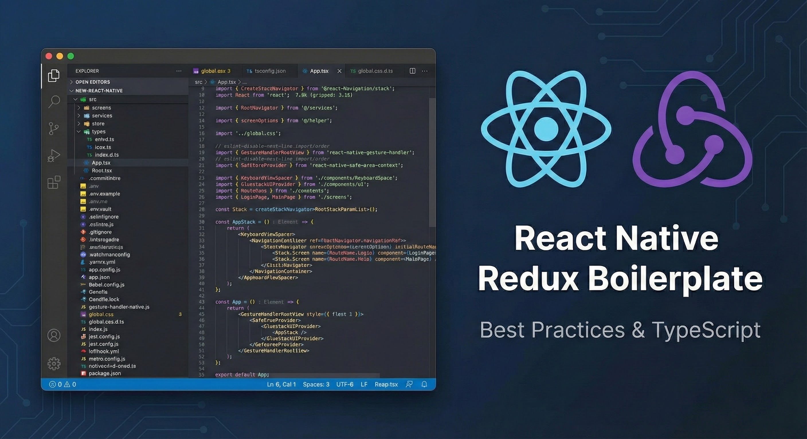

<div align="center">
  
</div>

<div>
  <h1>🚀 New React Native Project</h1>
  <p>A powerful React Native boilerplate with production-ready configurations and best practices</p>
  <p><strong>Create a new project using our CLI: <a href="https://github.com/linhnguyen-gt/create-rn-project">create-rn-project</a></strong></p>

  <p>
    <a href="https://reactnative.dev/" target="_blank">
      
    </a>
    <a href="https://www.typescriptlang.org/" target="_blank">
      
    </a>
  </p>

### Core Libraries

  <p>
    
    
  </p>

### State Management & API

  <p>
    
    
    
  </p>

### UI & Styling

  <p>
    
    
    
  </p>

### Form & Validation

  <p>
    
    
  </p>

### Development & Testing

  <p>
    
    
    
  </p>

### Environment & Storage

  <p>
    
    
  </p>

### Development Tools

  <p>
    
    
  </p>

### Environment Support

  <p>
    
    
  </p>
</div>

## Features

- Built with TypeScript for type safety
- Cross-platform (iOS & Android) support
- Redux + Redux Saga for state management
- NativeWind for styling with Tailwind CSS
- Reactotron integration for debugging
- Multi-environment support (Development, Staging, Production)
- Pre-configured folder structure
- ESLint + Prettier for code quality
- NativeWind-based UI component library
- Environment-specific configurations

## Quick Start

### Prerequisites

Make sure you have the following installed:

- Node.js (v20+)
- Yarn
- React Native CLI
- Xcode (for iOS)
- Android Studio (for Android)
- Ruby (>= 2.6.10)
- CocoaPods

### Installation

### Clone the repository\*\*

```bash
git clone https://github.com/linhnguyen-gt/new-react-native
cd new-react-native
```

## Environment Configuration

### Setup New Environment

First, you need to run the environment setup script:

```bash
# Using npm
npm run env:setup

# Using pnpm
pnpm env:setup
```

This script will:

1. Set up dotenv-vault (optional)
2. Create environment files for all environments:
    - `.env` (Development environment)
    - `.env.staging` (Staging environment)
    - `.env.production` (Production environment)
3. Configure necessary environment variables

### Environment Files Structure

Each environment file contains:

```bash
# Required Variables
APP_FLAVOR=development|staging|production
VERSION_CODE=1
VERSION_NAME=1.0.0
API_URL=https://api.example.com
APP_NAME=""

# Optional Variables (configured during setup)
GOOGLE_API_KEY=
FACEBOOK_APP_ID=
# ... other variables
```

### Using Different Environments

```bash
# Development (default)
pnpm android
pnpm ios

# Staging
pnpm android:stg
pnpm ios:stg

# Production
pnpm android:pro
pnpm ios:prod
```

### Setup Steps for New Project

The native projects are **not** in this repository. `ios/` and `android/` are build output,
regenerated from `app.config.ts` and `plugins/` by Continuous Native Generation:

```bash
pnpm env:setup     # create .env, .env.staging, .env.production
pnpm prebuild      # regenerate ios/ and android/
```

The run scripts prebuild for you, so `pnpm prebuild` is only needed when you want the native
projects without building. They do it through `scripts/run-app.js` rather than relying on
`expo run:<platform>`, which prebuilds **only when the native directory is missing** — with
`ios/` already on disk, changing `APP_ENV` alone would compile a binary still carrying the
previous environment's bundle id, display name and version.

There is nothing to set up by hand: no Xcode scheme, no Android product flavor, no build phase
to paste in. Editing `ios/` or `android/` directly has no lasting effect, because the next
prebuild discards it.

### Environment Configuration

Everything per-environment lives in `app.config.ts`:

| APP_ENV       | env file          | bundle id (iOS and Android)     |
| ------------- | ----------------- | ------------------------------- |
| `development` | `.env`            | `com.newreactnative`            |
| `staging`     | `.env.staging`    | `com.newreactnative.stg`        |
| `production`  | `.env.production` | `com.newreactnative.production` |

| Native value                             | Comes from                                                     |
| ---------------------------------------- | -------------------------------------------------------------- |
| Bundle id / package                      | `ENV_TARGETS[env].bundleId`                                    |
| App version                              | `VERSION_NAME`                                                 |
| iOS build number / Android `versionCode` | `VERSION_CODE`                                                 |
| Display name                             | `APP_NAME` → `CFBundleDisplayName` (iOS), `app_name` (Android) |

Switching environment re-runs prebuild instead of selecting a variant, so it is slower to
switch than flavors were. The three builds still install side by side, because their bundle ids
differ.

### Config Plugins

Three plugins carry the only native changes prebuild cannot infer. Change these rather than the
generated projects:

| Plugin                                | What it does                                           |
| ------------------------------------- | ------------------------------------------------------ |
| `plugins/with-android-abi-splits.js`  | per-ABI plus universal APK split                       |
| `plugins/with-react-native-config.js` | applies `dotenv.gradle` so native code sees env values |
| `plugins/with-android-app-name.js`    | per-environment Android launcher label                 |

iOS needs no plugin for react-native-config — its podspec carries its own build script phase,
which CocoaPods runs before compiling.

### Two Env Mechanisms, One File

|                       | Source                                              | Readable from |
| --------------------- | --------------------------------------------------- | ------------- |
| `expo-constants`      | `app.config.ts` → `extra`, selected by `APP_ENV`    | JS            |
| `react-native-config` | `BuildConfig` / `Info.plist`, selected by `ENVFILE` | JS and native |

Both read the same `.env*` file but through **different variables**, so every run script exports
`APP_ENV` and `ENVFILE` together. `src/services/environment.ts` compares the two sources at
startup and throws if they disagree — otherwise a build with only one variable set would ship a
JS bundle and a native binary describing different environments, with no error anywhere.

Two rules for `.env*` files, both enforced at runtime:

- **No trailing `#` comment on a value line.** dotenv strips it; react-native-config keeps
  everything after `=` on both platforms, so the native side would receive the comment text as
  part of the value.
- **No empty values.** `app.config.ts` rejects them; delete the line instead.

See `.env.example`.

### Version Management

The setup automatically manages app versions based on environment files:

- VERSION_CODE: Used for internal build numbering
- VERSION_NAME: Used for display version in stores

### Important Notes

- `ios/` and `android/` are gitignored build output. Run `pnpm prebuild` after cloning, and
  never commit them or expect a hand-edit there to survive
- Never commit `.env` files to git (they are automatically added to .gitignore)
- Always commit `.env.example` and `.env.vault` (if using dotenv-vault)
- Share vault credentials with your team members if using dotenv-vault

## Project Structure

```
src/
├── App.tsx          # Main App component
├── Root.tsx         # Root component with Redux Provider
├── apis/            # API integration
├── components/      # Reusable UI components
├── constants/       # Constants Keys
├── enums/           # TypeScript enums
├── helper/          # Helper functions
├── hooks/           # Custom React hooks
├── models/          # Models related to API
└── redux/           # Redux store configuration
    ├── actions/     # Redux actions
    ├── reducers/    # Redux reducers
    ├── sagas/       # Redux sagas
    └── selectors/   # Redux selectors
├── screens/         # Screen components
├── services/        # Business logic and services
    └── reactotron/  # Reactotron configuration
    └── navigation/  # Navigation configuration
    └── httpClient/  # Base API client configuration
└── store/           # Redux store configuration
└── types/           # TypeScript types

```

## Development Tools

### Reactotron

For debugging, the project includes Reactotron integration. To use it:

1. Install Reactotron on your development machine
2. Run the following command for Android:

```bash
pnpm adb:reactotron
```

## Code Style

The project uses ESLint and Prettier for code formatting. Run linting with:

```bash
pnpm lint # Check for issues
```

To fix linting errors automatically, use:

```bash
pnpm lint:fix # Fix automatic issues
```
