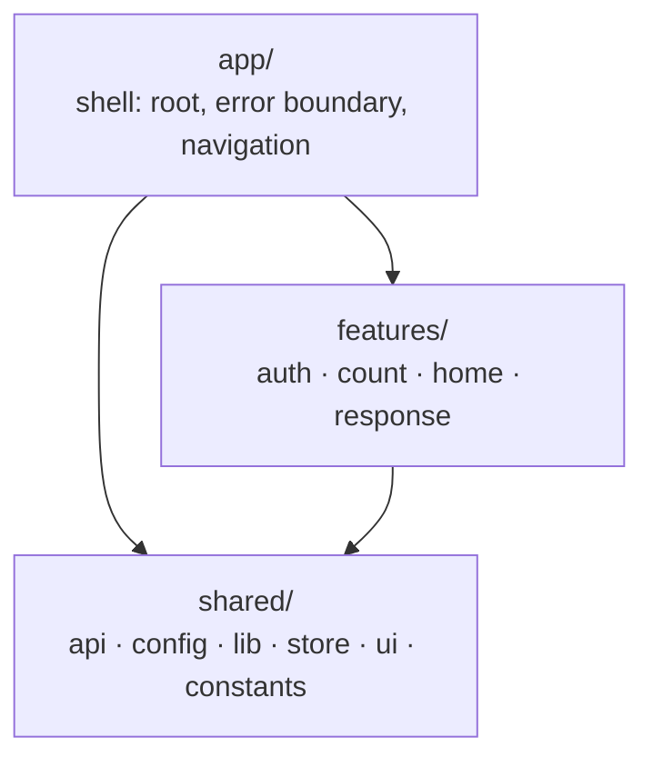
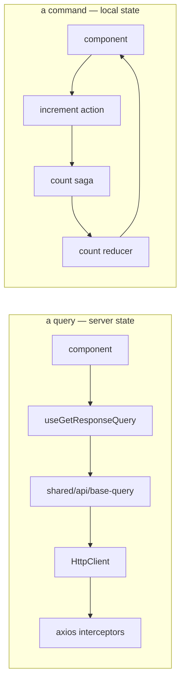
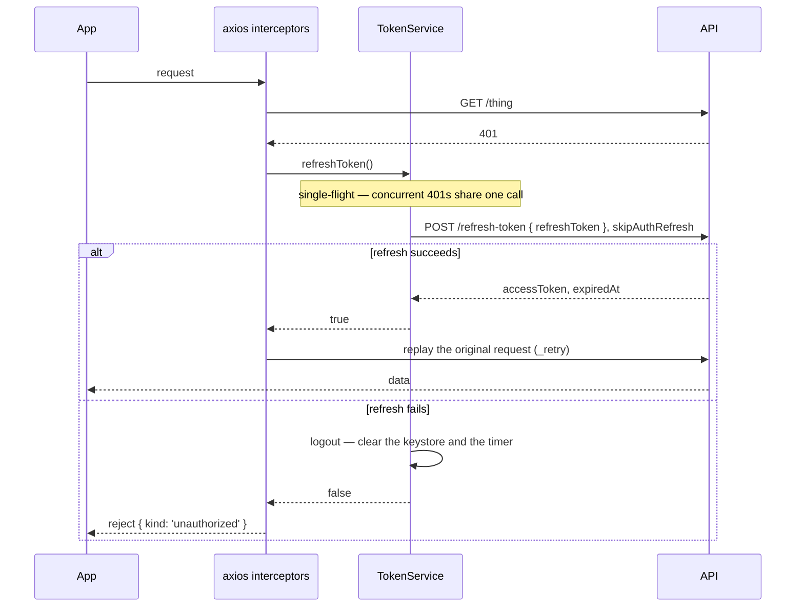

# System Architecture

How the app is put together, and why. Naming, TypeScript and testing rules live in
[code-standards.md](./code-standards.md); the directory-by-directory map lives in
[codebase-summary.md](./codebase-summary.md).

## Shape

Three top-level layers under `src/`, plus ambient types:



The arrows are the whole rule. **A feature never imports another feature.** It imports `shared/`,
and the app shell composes features into screens. `npx madge --circular --extensions ts,tsx src`
is the gate: a feature-first tree makes feature-to-feature cycles easy to introduce, so it must
report none.

A feature owns its `api/`, `model/` and `ui/`. `shared/` holds infrastructure and anything two
features need.

## Server state vs local state

Two mechanisms live in one store, with a boundary that is not decided per-feature:

| State                                    | Mechanism  | Example                                                   |
| ---------------------------------------- | ---------- | --------------------------------------------------------- |
| Server state                             | RTK Query  | `features/response` — fetch, cache, loading, error, retry |
| Local state with a multi-step async flow | redux-saga | `features/count` — delay, then dispatch                   |

RTK Query is not a replacement for the saga layer and the saga layer is not a cache. Reach for
RTKQ when the data belongs to a server; reach for a saga when the flow is the interesting part.



`shared/api/base-query.ts` wraps `getHttpClient()` rather than using `fetchBaseQuery`, so an RTKQ
endpoint and a plain request behave identically on a 401, on a timeout and on error
classification. All of that lives in the axios interceptors, and `fetchBaseQuery` would fork it.

The RTKQ cache is combined into the same reducer tree, so `RESET_STATE` drops it along with
everything else — there is no separate `resetApiState()` call on logout.

## Failures are values

`HttpClient.request` never rejects and never resolves to `undefined`. It returns a discriminated
union:

```ts
type HttpResponse<T> =
    | { ok: true; data: T; status: number; headers?: Record<string, any> }
    | { ok: false; error: ApiError; status?: number };
```

Narrowing on `ok` gives the caller either `data` or `error`, and the compiler stops them reading
the wrong one. `ApiError.kind` (`network | timeout | unauthorized | client | server | unknown`) is
what lets a caller choose between a retry button and a message. The transport never draws UI.

Payloads are validated where they enter: `transformResponse` runs the zod schema and throws on a
mismatch, so an API that changes shape produces an error state rather than silently wrong data.

## Auth and the refresh cycle



Three properties, each of which the boilerplate previously got wrong:

- **The refresh identifies the session.** The stored token is sent in the request body, not merely
  read as a null check.
- **One 401 buys one retry.** `_retry` is set before the replay and checked first, so a second 401
  falls through to logout instead of looping.
- **The refresh call cannot trigger itself.** `skipAuthRefresh` makes the response interceptor
  bypass the refresh branch for that one request.

The refresh token lives in the platform keystore (`expo-secure-store`,
`WHEN_UNLOCKED_THIS_DEVICE_ONLY`). The access token lives only in the axios default headers, so it
never touches disk. Nothing about either is ever logged — see the logging policy in
[code-standards.md](./code-standards.md).

If the backend moves to a refresh cookie, the change is two lines: drop the body in
`shared/api/token-service.ts` and enable `withCredentials` in the axios factory.

## Navigation

React Navigation 7, one stack. Expo Router was considered and rejected for now: on SDK 57,
[expo/expo#47687](https://github.com/expo/expo/issues/47687) reports release builds hanging on the
native splash with Tabs plus nested Stacks. Revisit when it closes.

`app/navigation/types.ts` declares `RootStackParamList` and augments
`ReactNavigation.RootParamList`, so `useNavigation()` is typed in every screen without a generic
at the call site and an unknown route name is a compile error.

**Inside the tree, use `useNavigation()`.** `RootNavigator` — the module singleton holding the
container ref — exists for callers React cannot reach, `TokenService.logout()` being the real one.
A screen reaching for it is a smell.

## Bootstrap

`index.js` → `app/root.tsx` → `createAppStore()` → `<Provider>` → `app/app.tsx`.

Nothing runs at import time: `environment` is a facade of getters, the http client comes from
`getHttpClient()`, and Reactotron connects from `initReactotron()`. A bad `.env` therefore throws
inside the bootstrap try/catch and renders `BootstrapErrorScreen`, instead of throwing while the
module graph loads and leaving a white screen with no log. A failed `sagaMiddleware.run()` is
fatal for the same reason: a store with no watchers looks fine and does nothing.
